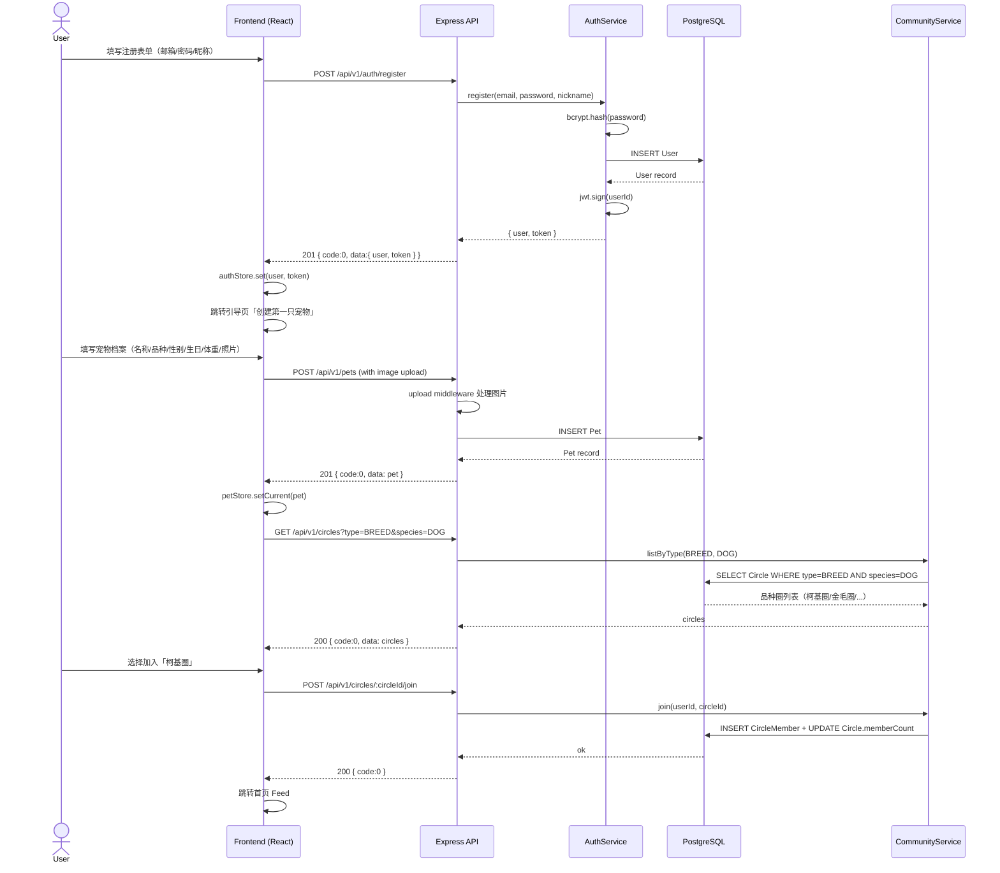
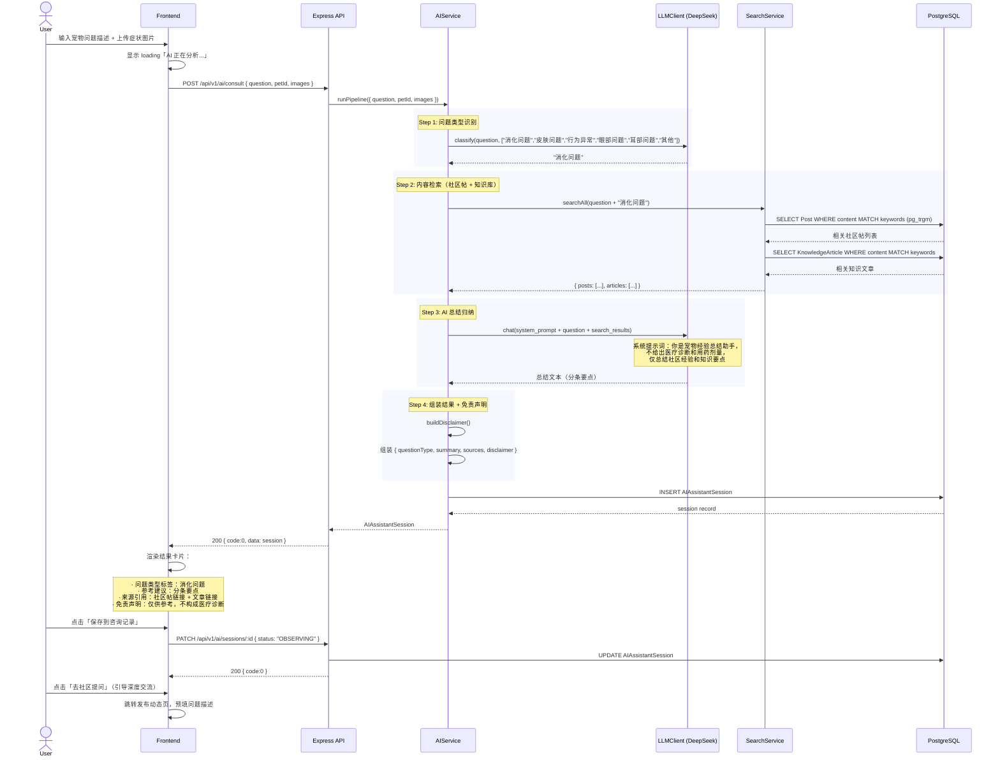
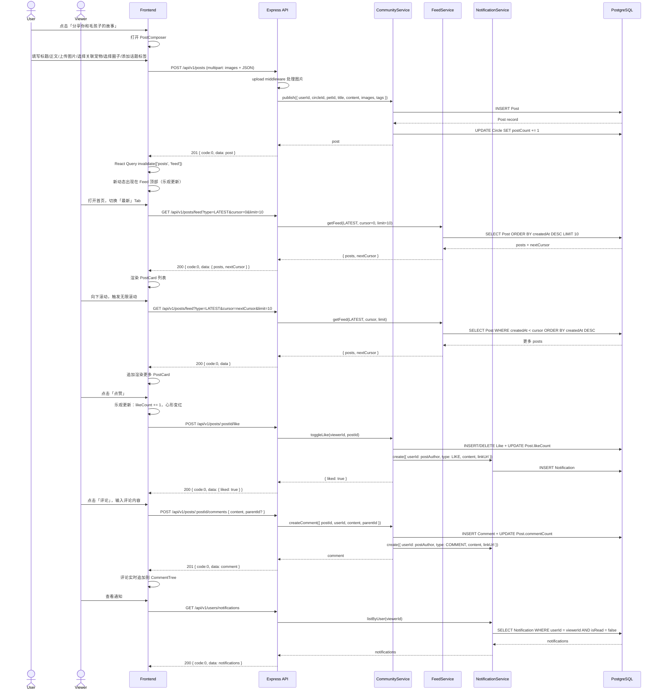
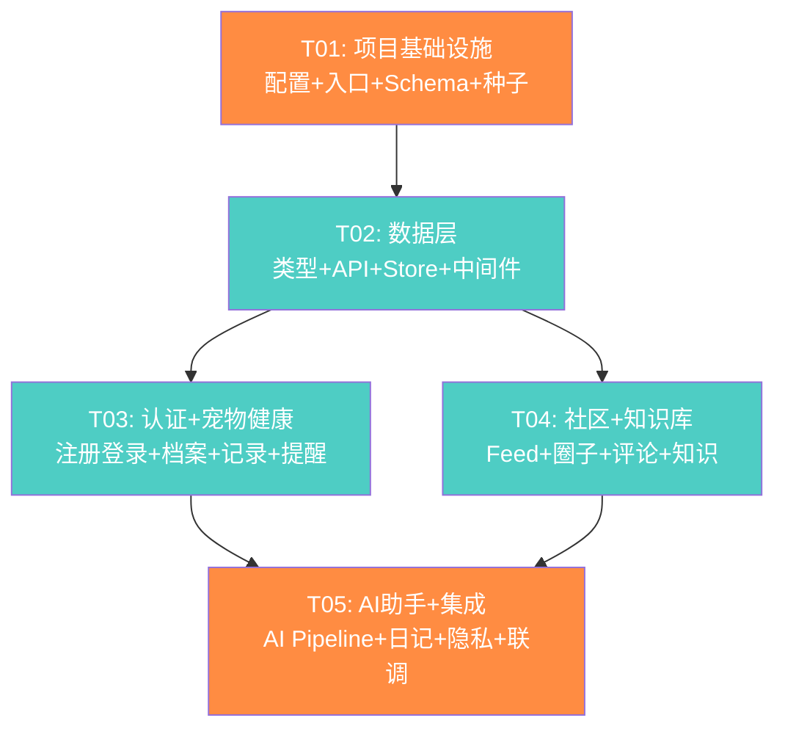

# PawPal（爪友）系统架构设计 + 任务分解

> **版本**：v1.0
> **作者**：高见远（架构师）
> **日期**：2026-06-24
> **基于**：PRD v1.1（产品经理 许清楚）
> **状态**：待评审

---

## 一、实现方案 + 框架选型

### 1.1 核心技术挑战分析

| 挑战 | 说明 | 应对方案 |
|------|------|---------|
| **AI 助手非诊断 pipeline** | 需实现"问题识别 → 内容检索 → AI 总结 → 免责声明"的多步 pipeline，不能做医疗诊断 | 分层设计：LLM 做问题分类 + 结果归纳，PostgreSQL 全文检索 + 外部内容抓取做信息源，输出层固定附加免责声明 |
| **前后端分离 + API 复用** | Web MVP 后可能扩展移动端，API 必须 RESTful 且可独立复用 | Express 独立部署，严格 RESTful 规范，JWT 无状态认证，API 版本化（/api/v1） |
| **社区冷启动内容导入** | 需预填充 50+ 篇品种知识 + 20 个品种圈，需批量导入机制 | Prisma seed 脚本 + 知识库批量导入 API，数据结构支持运营后台扩展 |
| **数据隐私合规** | GDPR/个保法要求：数据加密 + 用户数据导出/删除 | 字段级加密（AES-256）、数据导出 API（JSON 打包）、软删除 + 定期硬删除机制 |
| **智能提醒调度** | 疫苗/驱虫到期提醒需定时计算和推送 | node-cron 定时任务 + 提醒计算服务，站内通知 + 预留推送通道 |
| **无限滚动 Feed 流** | 社区动态需高效分页 + 推荐排序 | 游标分页（cursor-based pagination）+ 混合排序策略（时间 + 热度） |

### 1.2 技术栈选型

#### 前端

| 技术 | 版本 | 选型理由 |
|------|------|---------|
| **Vite** | ^5.4.0 | 极速 HMR + 开发体验，Vue/React 生态首选构建工具 |
| **React** | ^18.3.0 | 成熟生态、团队熟悉、MUI/Tailwind 完美集成 |
| **TypeScript** | ^5.5.0 | 类型安全，降低前后端协作成本 |
| **MUI (Material-UI)** | ^5.16.0 | PRD 指定，组件丰富，主题定制能力强，圆角卡片式布局友好 |
| **Tailwind CSS** | ^3.4.0 | PRD 指定，原子化 CSS 快速调整样式，与 MUI 互补 |
| **React Router** | ^6.26.0 | React 生态标准路由方案 |
| **Zustand** | ^4.5.0 | 轻量状态管理，API 简洁，避免 Redux 样板代码 |
| **TanStack Query (React Query)** | ^5.51.0 | 服务端状态管理（缓存、轮询、乐观更新），无限滚动场景天然适配 |
| **Axios** | ^1.7.0 | HTTP 客户端，拦截器统一处理认证头和错误 |
| **Recharts** | ^2.12.0 | 体重曲线折线图，React 原生集成 |
| **date-fns** | ^3.6.0 | 日期处理（提醒计算、时间格式化） |
| **Lucide React** | ^0.428.0 | PRD 指定的图标库，轻量美观 |

#### 后端

| 技术 | 版本 | 选型理由 |
|------|------|---------|
| **Node.js** | ^20.x LTS | 高并发 I/O，前后端同语言（TS），生态丰富 |
| **Express** | ^4.19.0 | 最成熟的 Node Web 框架，中间件生态完善，学习成本低 |
| **TypeScript** | ^5.5.0 | 前后端类型统一，Prisma 类型安全 |
| **Prisma** | ^5.18.0 | 类型安全 ORM，Migration 管理，Schema 即文档，seed 脚本友好 |
| **PostgreSQL** | ^16 | 关系型主库，支持 JSONB 灵活字段 + pg_trgm 全文检索，适合社区内容搜索 |
| **JWT (jsonwebtoken)** | ^9.0.2 | 无状态认证，前后端分离 + 移动端复用必备 |
| **Bcrypt** | ^5.1.1 | 密码哈希，业界标准 |
| **Multer** | ^1.4.5-lts.1 | 文件上传中间件（宠物照片、健康凭证、动态图片） |
| **node-cron** | ^3.0.3 | 定时任务调度（提醒计算、数据清理） |
| **Zod** | ^3.23.0 | 请求参数校验，类型推导一体化 |
| **Winston** | ^3.14.0 | 结构化日志 |
| **Helmet + CORS + Express Rate Limit** | latest | 安全中间件套件 |

#### AI / 搜索

| 技术 | 用途 |
|------|------|
| **DeepSeek API（或 OpenAI 兼容接口）** | 问题类型识别 + 经验总结归纳。选 DeepSeek 因中文理解强、成本低，API 兼容 OpenAI 格式可无缝切换 |
| **PostgreSQL pg_trgm + 全文检索** | 社区历史帖 + 知识库的站内搜索，MVP 阶段足够，无需额外引入 Elasticsearch |
| **外部内容检索** | MVP 阶段通过预置权威来源 URL 列表 + LLM 知识库做辅助，不实时爬取（合规 + 性能） |

#### 存储

| 技术 | 用途 |
|------|------|
| **本地磁盘存储（MVP）** | 图片上传暂存 `server/uploads/`，通过 Express 静态服务 |
| **S3 兼容对象存储（预留）** | 生产环境切换，存储服务抽象为接口，仅需改实现类 |

### 1.3 架构模式

```
┌─────────────────────────────────────────────────────┐
│                    浏览器 (Web App)                    │
│  Vite + React + MUI + Tailwind + Zustand + ReactQuery │
└──────────────────────┬──────────────────────────────┘
                       │ HTTPS / RESTful API (JSON)
                       ▼
┌─────────────────────────────────────────────────────┐
│              Express API Server (Node.js)             │
│  ┌─────────┐ ┌──────────┐ ┌───────────┐ ┌─────────┐ │
│  │ Routes  │→│Controllers│→│ Services  │→│ Prisma  │ │
│  └─────────┘ └──────────┘ └─────┬─────┘ └────┬────┘ │
│  ┌──────────────────────────────┘            │      │
│  │ Middleware: Auth(JWT) / Upload / Error    │      │
│  └───────────────────────────────────────────┘      │
│  ┌─────────────┐  ┌──────────────┐  ┌────────────┐  │
│  │ AI Pipeline │  │ Cron Scheduler│  │  LLM Client│  │
│  └──────┬──────┘  └──────────────┘  └─────┬──────┘  │
└─────────┼──────────────────────────────────┼────────┘
          │                                  │
          ▼                                  ▼
┌─────────────────┐              ┌──────────────────┐
│   PostgreSQL    │              │  DeepSeek LLM API │
│  + pg_trgm 索引  │              └──────────────────┘
└─────────────────┘
          │
          ▼
┌─────────────────┐
│ 本地文件存储      │
│ /server/uploads  │
└─────────────────┘
```

**分层架构（后端）**：Routes → Controllers（请求/响应处理）→ Services（业务逻辑）→ Prisma（数据访问）。中间件层横切认证、错误处理、文件上传、限流。

**状态管理（前端）**：Zustand 管理客户端状态（认证态、当前选中宠物、UI 状态），React Query 管理服务端状态（API 数据缓存、分页、乐观更新）。

---

## 二、文件列表及相对路径

### 2.1 前端（client/）

```
client/
├── index.html                              # HTML 入口
├── package.json                            # 前端依赖声明
├── vite.config.ts                          # Vite 构建配置 + 代理
├── tsconfig.json                           # TypeScript 配置
├── tailwind.config.ts                      # Tailwind 主题配置（暖橙 #FF8C42 + 薄荷绿 #4ECDC4）
├── postcss.config.js                       # PostCSS 配置
├── src/
│   ├── main.tsx                            # React 入口，挂载 App + Provider
│   ├── App.tsx                             # 根组件 + 路由定义 + 全局 Provider
│   ├── theme/
│   │   └── index.ts                        # MUI 主题（主色、圆角、字体）
│   ├── types/
│   │   └── index.ts                        # 全局 TypeScript 类型定义（与后端共享）
│   ├── utils/
│   │   ├── constants.ts                    # 常量（品种列表、记录类型、API 路径）
│   │   ├── date.ts                         # 日期格式化/计算工具
│   │   └── validation.ts                   # 表单校验规则
│   ├── api/
│   │   ├── client.ts                       # Axios 实例 + 请求/响应拦截器（JWT 注入）
│   │   ├── auth.ts                         # 认证 API（注册/登录/用户信息）
│   │   ├── pets.ts                         # 宠物档案 API
│   │   ├── health.ts                       # 健康记录 + 体重 + 提醒 API
│   │   ├── community.ts                    # 社区动态/圈子/评论 API
│   │   ├── ai.ts                           # AI 助手 API
│   │   └── knowledge.ts                    # 知识库 API
│   ├── store/
│   │   ├── authStore.ts                    # 认证状态（用户信息、token、登录/登出）
│   │   ├── petStore.ts                     # 当前选中宠物状态
│   │   └── uiStore.ts                      # UI 状态（侧边栏、主题、全局 loading）
│   ├── hooks/
│   │   ├── useAuth.ts                      # 认证 hook（封装 authStore + API）
│   │   ├── usePets.ts                      # 宠物数据 hook（React Query 封装）
│   │   ├── usePosts.ts                     # 社区动态 hook（无限滚动 + 乐观更新）
│   │   └── useAI.ts                        # AI 助手 hook（流式结果 + 历史记录）
│   ├── components/
│   │   ├── layout/
│   │   │   ├── MainLayout.tsx              # 三栏布局骨架（左导航 + 中内容 + 右侧栏）
│   │   │   ├── Sidebar.tsx                 # 左侧导航栏
│   │   │   └── RightSidebar.tsx            # 右侧侧边栏（热门话题/圈子推荐/同城宠友）
│   │   ├── common/
│   │   │   ├── PetSwitcher.tsx             # 多宠切换器（头像横滑选择）
│   │   │   ├── ImageUploader.tsx           # 图片上传组件（预览 + 压缩）
│   │   │   ├── InfiniteScrollList.tsx      # 无限滚动通用列表
│   │   │   ├── EmptyState.tsx             # 空状态占位
│   │   │   └── ConfirmDialog.tsx           # 确认对话框（删除操作）
│   │   ├── community/
│   │   │   ├── PostCard.tsx                # 动态卡片（头像/标题/正文/九宫格图/互动栏）
│   │   │   ├── PostComposer.tsx            # 动态发布器（标题/正文/图片/关联宠物/话题）
│   │   │   ├── CommentTree.tsx             # 多级评论树（二级回复）
│   │   │   └── CircleCard.tsx              # 圈子卡片
│   │   ├── health/
│   │   │   ├── HealthRecordForm.tsx        # 健康记录表单（疫苗/驱虫/体检/就诊）
│   │   │   ├── HealthTimeline.tsx          # 健康记录时间轴
│   │   │   ├── WeightChart.tsx             # 体重曲线图（Recharts 折线图）
│   │   │   └── ReminderCard.tsx            # 提醒卡片（颜色区分紧急程度）
│   │   └── ai/
│   │       ├── AIResultCard.tsx            # AI 结果卡片（问题类型/参考建议/来源/免责）
│   │       └── AIHistoryList.tsx           # 咨询历史列表
│   └── pages/
│       ├── auth/
│       │   ├── LoginPage.tsx               # 登录页
│       │   └── RegisterPage.tsx            # 注册页（注册后引导创建宠物）
│       ├── feed/
│       │   └── FeedPage.tsx                # 首页社区 Feed（推荐/最新/关注 Tab）
│       ├── pets/
│       │   ├── PetListPage.tsx             # 宠物列表/选择页
│       │   ├── PetDetailPage.tsx           # 宠物详情页（健康记录/成长日记/提醒 Tab）
│       │   ├── PetFormPage.tsx             # 创建/编辑宠物档案
│       │   └── ReminderPage.tsx            # 提醒日程页（日历/列表视图）
│       ├── ai/
│       │   └── AIAssistantPage.tsx         # AI 助手页（输入/结果/历史）
│       ├── community/
│       │   ├── CircleSquarePage.tsx        # 圈子广场
│       │   ├── CircleDetailPage.tsx        # 圈子详情（圈内 Feed + 加入/退出）
│       │   └── PostDetailPage.tsx          # 动态详情页（正文 + 评论）
│       ├── knowledge/
│       │   └── KnowledgeBasePage.tsx       # 知识库页（分类浏览 + 搜索）
│       └── profile/
│           └── ProfilePage.tsx             # 个人主页（动态/宠物/收藏 Tab + 数据导出）
```

### 2.2 后端（server/）

```
server/
├── package.json                            # 后端依赖声明
├── tsconfig.json                           # TypeScript 配置
├── .env.example                            # 环境变量模板
├── prisma/
│   └── schema.prisma                       # 数据库 Schema（所有模型定义）
├── scripts/
│   └── seed.ts                             # 种子数据（50+ 知识文章 + 20 品种圈 + 管理员账号）
├── uploads/                                # 文件上传目录（MVP 本地存储）
└── src/
    ├── index.ts                            # 服务器入口（启动 Express + Cron + DB 连接）
    ├── app.ts                              # Express 应用配置（中间件注册 + 路由挂载）
    ├── config/
    │   ├── index.ts                        # 环境变量加载 + 配置导出
    │   └── database.ts                     # Prisma Client 单例
    ├── routes/
    │   ├── index.ts                        # 路由聚合器（统一挂载 /api/v1）
    │   ├── authRoutes.ts                   # /auth — 注册/登录/刷新token
    │   ├── userRoutes.ts                   # /users — 个人主页/关注/数据导出/删除
    │   ├── petRoutes.ts                    # /pets — 宠物档案 CRUD
    │   ├── healthRoutes.ts                 # /pets/:petId/health — 健康记录/体重/提醒
    │   ├── communityRoutes.ts              # /posts, /circles — 动态/圈子/评论/点赞
    │   ├── aiRoutes.ts                     # /ai — AI 助手咨询/历史
    │   └── knowledgeRoutes.ts              # /knowledge — 知识库浏览/搜索
    ├── controllers/
    │   ├── authController.ts               # 注册/登录逻辑
    │   ├── userController.ts               # 用户信息/关注/数据隐私
    │   ├── petController.ts                # 宠物档案 CRUD
    │   ├── healthController.ts             # 健康记录/体重/提醒管理
    │   ├── communityController.ts          # 动态发布/Feed/圈子/评论
    │   ├── aiController.ts                 # AI 咨询请求处理
    │   └── knowledgeController.ts          # 知识库查询
    ├── services/
    │   ├── authService.ts                  # JWT 签发/验证 + 密码哈希
    │   ├── petService.ts                   # 宠物档案业务逻辑
    │   ├── healthService.ts                # 健康记录 + 体重记录业务逻辑
    │   ├── reminderService.ts              # 提醒计算 + 调度（下次日期计算/状态更新）
    │   ├── communityService.ts             # 动态/圈子/评论/点赞业务逻辑
    │   ├── aiService.ts                    # AI Pipeline 编排（识别→检索→总结→免责）
    │   ├── llmClient.ts                    # DeepSeek/OpenAI LLM API 封装
    │   ├── searchService.ts                # 内容检索（PostgreSQL 全文搜索 + 知识库）
    │   ├── knowledgeService.ts             # 知识库文章管理 + 批量导入
    │   ├── notificationService.ts          # 站内通知（提醒/互动通知）
    │   ├── dataPrivacyService.ts           # 数据加密/导出/删除（GDPR 合规）
    │   └── feedService.ts                  # Feed 流组装（推荐/最新/关注 排序 + 分页）
    ├── middleware/
    │   ├── auth.ts                         # JWT 认证中间件（可选认证 + 必须认证）
    │   ├── error.ts                        # 全局错误处理中间件
    │   ├── upload.ts                       # Multer 文件上传配置
    │   ├── validate.ts                     # Zod 参数校验中间件
    │   └── rateLimit.ts                    # 速率限制（AI 接口/认证接口）
    ├── utils/
    │   ├── crypto.ts                       # AES-256 加密/解密工具（敏感字段）
    │   ├── logger.ts                       # Winston 日志配置
    │   └── scheduler.ts                    # node-cron 定时任务（提醒计算/数据清理）
    └── types/
        └── index.ts                        # 后端专用类型（请求/响应/服务层类型）
```

### 2.3 文件职责总结

| 层 | 文件数 | 核心职责 |
|----|--------|---------|
| 前端基础设施 | 7 | 构建/类型/样式配置 + 入口 |
| 前端 API + Store + Hooks | 11 | 数据获取、状态管理、业务逻辑封装 |
| 前端组件 | 14 | 可复用 UI 组件（布局/通用/社区/健康/AI） |
| 前端页面 | 12 | 路由页面组件 |
| 后端基础设施 | 6 | 配置/入口/Schema/种子 |
| 后端路由 | 7 | API 端点定义 |
| 后端控制器 | 7 | 请求处理 + 响应格式化 |
| 后端服务 | 12 | 核心业务逻辑（含 AI Pipeline + 隐私合规） |
| 后端中间件 | 5 | 横切关注点 |
| 后端工具 | 3 | 加密/日志/调度 |

---

## 三、数据结构和接口（类图）

```mermaid
classDiagram
    class User {
        +String id
        +String email
        +String passwordHash
        +String nickname
        +String avatar
        +String bio
        +String city
        +MembershipLevel membershipLevel
        +DateTime createdAt
        +DateTime updatedAt
        +register(email, password, nickname) User
        +login(email, password) String
        +updateProfile(data) void
        +exportData() Buffer
        +deleteAccount() void
    }

    class Pet {
        +String id
        +String userId
        +String name
        +PetSpecies species
        +String breed
        +PetGender gender
        +DateTime birthday
        +Float weight
        +String photo
        +Boolean neutered
        +DateTime createdAt
        +DateTime updatedAt
        +create(data) Pet
        +update(id, data) Pet
        +delete(id) void
        +calculateAge() Number
    }

    class HealthRecord {
        +String id
        +String petId
        +HealthRecordType type
        +DateTime date
        +String itemName
        +String notes
        +String[] images
        +DateTime createdAt
        +create(data) HealthRecord
        +update(id, data) HealthRecord
        +delete(id) void
        +listByPet(petId, filters) HealthRecord[]
    }

    class WeightRecord {
        +String id
        +String petId
        +Float weight
        +DateTime date
        +DateTime createdAt
        +record(petId, weight, date) WeightRecord
        +getTrend(petId, range) WeightRecord[]
    }

    class Reminder {
        +String id
        +String petId
        +ReminderType type
        +DateTime nextDate
        +Int cycleDays
        +ReminderStatus status
        +DateTime createdAt
        +calculateNext(lastDate, cycleDays) DateTime
        +markNotified(id) void
        +listByUser(userId) Reminder[]
    }

    class Notification {
        +String id
        +String userId
        +NotificationType type
        +String content
        +String linkUrl
        +Boolean isRead
        +DateTime createdAt
        +create(data) Notification
        +markAsRead(id) void
        +listUnread(userId) Notification[]
    }

    class Post {
        +String id
        +String userId
        +String circleId
        +String petId
        +String title
        +String content
        +String[] images
        +String[] tags
        +Int likeCount
        +Int commentCount
        +DateTime createdAt
        +publish(data) Post
        +delete(id) void
        +getFeed(type, cursor, limit) Post[]
    }

    class Comment {
        +String id
        +String postId
        +String userId
        +String parentId
        +String content
        +DateTime createdAt
        +create(data) Comment
        +listByPost(postId) Comment[]
        +delete(id) void
    }

    class Like {
        +String id
        +String userId
        +String postId
        +DateTime createdAt
        +toggle(userId, postId) void
    }

    class Circle {
        +String id
        +String name
        +CircleType type
        +PetSpecies species
        +String coverImage
        +String description
        +Int memberCount
        +DateTime createdAt
        +create(data) Circle
        +join(userId, circleId) void
        +leave(userId, circleId) void
        +listByType(type) Circle[]
    }

    class CircleMember {
        +String id
        +String circleId
        +String userId
        +DateTime joinedAt
    }

    class Follow {
        +String id
        +String followerId
        +String followeeId
        +DateTime createdAt
        +toggle(followerId, followeeId) void
        +listFollowers(userId) User[]
        +listFollowing(userId) User[]
    }

    class AIAssistantSession {
        +String id
        +String userId
        +String petId
        +String question
        +String[] imageUrls
        +String questionType
        +String summary
        +JsonArray sources
        +SessionStatus status
        +DateTime createdAt
        +consult(data) AIAssistantSession
        +listByUser(userId) AIAssistantSession[]
        +updateStatus(id, status) void
    }

    class KnowledgeArticle {
        +String id
        +String title
        +PetSpecies species
        +String breed
        +String category
        +String content
        +String author
        +DateTime createdAt
        +create(data) KnowledgeArticle
        +batchImport(articles[]) void
        +search(keyword, filters) KnowledgeArticle[]
    }

    class GrowthDiary {
        +String id
        +String petId
        +JsonArray milestones
        +String[] photos
        +DateTime createdAt
        +generate(petId) GrowthDiary
        +shareToCommunity(diaryId) Post
    }

    class AIService {
        +identifyQuestionType(question, images) String
        +searchContent(questionType, keywords) SearchResult
        +summarize(question, searchResults) String
        +buildDisclaimer() String
        +runPipeline(data) AIAssistantSession
    }

    class LLMClient {
        +String apiUrl
        +String apiKey
        +chat(messages, options) String
        +classify(text, categories) String
    }

    class SearchService {
        +searchPosts(keyword, limit) Post[]
        +searchKnowledge(keyword, filters) KnowledgeArticle[]
        +searchAll(keyword) SearchResult
    }

    class DataPrivacyService {
        +encryptField(value) String
        +decryptField(encrypted) String
        +exportUserData(userId) Buffer
        +deleteUserData(userId) void
    }

    class ReminderService {
        +calculateNextDate(lastDate, cycleDays) DateTime
        +generateReminders(petId) Reminder[]
        +processDueReminders() void
        +sendNotification(userId, reminder) void
    }

    %% 关系
    User "1" --> "N" Pet : owns
    User "1" --> "N" Post : publishes
    User "1" --> "N" AIAssistantSession : consults
    User "1" --> "N" Notification : receives
    User "1" --> "N" Follow : follows/followed
    User "1" --> "N" CircleMember : joins

    Pet "1" --> "N" HealthRecord : has
    Pet "1" --> "N" WeightRecord : tracks
    Pet "1" --> "N" Reminder : schedules
    Pet "1" --> "1" GrowthDiary : generates

    Circle "1" --> "N" Post : contains
    Circle "1" --> "N" CircleMember : has
    Circle "1" --> "N" KnowledgeArticle : curates

    Post "1" --> "N" Comment : has
    Post "1" --> "N" Like : receives

    AIService --> LLMClient : uses
    AIService --> SearchService : uses
    AIService --> AIAssistantSession : creates
    ReminderService --> Reminder : manages
    ReminderService --> Notification : sends
    DataPrivacyService --> User : protects
```



### 枚举类型定义

```
enum PetSpecies { DOG, CAT }
enum PetGender { MALE, FEMALE }
enum HealthRecordType { VACCINE, DEWORMING, CHECKUP, VISIT }
enum ReminderType { VACCINE, DEWORMING, CHECKUP }
enum ReminderStatus { PENDING, NOTIFIED, DONE, OVERDUE }
enum NotificationType { REMINDER, LIKE, COMMENT, FOLLOW, SYSTEM }
enum CircleType { BREED, CITY }
enum SessionStatus { OBSERVING, RECOVERED, VISITED_DOCTOR }
enum MembershipLevel { FREE, PREMIUM }  // 预留商业化扩展
```

---

## 四、程序调用流程（时序图）

### 4.1 用户注册 → 创建宠物档案 → 加入品种圈（冷启动引导）



### 4.2 AI 助手搜索 → 总结建议（核心 AI Pipeline）



### 4.3 社区动态发布 → Feed 展示 → 互动



---

## 五、任务列表（有序、含依赖关系）

### 5.1 任务概览

| 任务 ID | 任务名 | 涉及文件 | 依赖 | 优先级 |
|---------|--------|---------|------|--------|
| **T01** | 项目基础设施搭建 | 前后端配置文件 + 入口文件 + Prisma Schema + 种子脚本 | 无 | P0 |
| **T02** | 数据层 + API 客户端 + 类型系统 | 前端 types/api/store/hooks + 后端 config/database/middleware | T01 | P0 |
| **T03** | 认证 + 宠物健康管理模块 | auth/pets/health 页面 + 组件 + 路由 + 控制器 + 服务 | T02 | P0 |
| **T04** | 社区 + 知识库模块 | feed/circle/post/knowledge 页面 + 组件 + 路由 + 控制器 + 服务 | T02 | P0 |
| **T05** | AI 助手 + 集成优化 | AI 页面/组件/服务 + 成长日记 + 通知 + 数据隐私 + 路由集成 | T03, T04 | P0 |

### 5.2 任务详细说明

#### T01: 项目基础设施搭建

**目标**：搭建前后端项目骨架，配置构建工具、TypeScript、数据库 Schema、种子数据，使项目可启动运行。

**涉及文件（19 个）**：

前端配置 + 入口：
- `client/package.json` — 前端依赖声明
- `client/vite.config.ts` — Vite 配置（dev proxy 代理 /api → localhost:3001）
- `client/tsconfig.json` — TypeScript 配置
- `client/tailwind.config.ts` — Tailwind 主题（暖橙 #FF8C42 / 薄荷绿 #4ECDC4 / 圆角）
- `client/postcss.config.js` — PostCSS 配置
- `client/index.html` — HTML 入口
- `client/src/main.tsx` — React 入口（挂载 + Provider）
- `client/src/App.tsx` — 根组件 + 路由骨架
- `client/src/theme/index.ts` — MUI 主题配置

后端配置 + 入口：
- `server/package.json` — 后端依赖声明
- `server/tsconfig.json` — TypeScript 配置
- `server/.env.example` — 环境变量模板（DB_URL, JWT_SECRET, LLM_API_KEY 等）
- `server/src/index.ts` — 服务器入口
- `server/src/app.ts` — Express 应用配置
- `server/src/config/index.ts` — 环境变量加载
- `server/src/config/database.ts` — Prisma Client 单例

数据库 + 种子：
- `server/prisma/schema.prisma` — 完整数据库 Schema（所有 15 个模型 + 枚举 + 关系 + 索引）
- `server/scripts/seed.ts` — 种子数据（50+ 知识文章 + 20 品种圈 + 测试用户）
- `server/src/utils/logger.ts` — Winston 日志配置

**验收标准**：
- `npm run dev` 前后端均可启动
- `npx prisma migrate dev` 成功创建所有表
- `npx prisma db seed` 成功导入种子数据
- 前端访问 `localhost:5173` 显示空白但无报错的页面
- 后端访问 `localhost:3001/api/v1/health` 返回 `{ code: 0, data: { status: "ok" } }`

**依赖**：无

---

#### T02: 数据层 + API 客户端 + 类型系统

**目标**：建立前后端数据通信基础设施——统一类型定义、API 客户端、状态管理、后端中间件。

**涉及文件（16 个）**：

前端类型 + API + 状态：
- `client/src/types/index.ts` — 全局类型定义（User, Pet, Post, AIAssistantSession 等，与 Prisma 模型对齐）
- `client/src/utils/constants.ts` — 常量（品种列表、记录类型枚举、API 路径、颜色映射）
- `client/src/utils/date.ts` — 日期工具（格式化、年龄计算、提醒倒计时）
- `client/src/utils/validation.ts` — 表单校验规则（邮箱/密码/必填）
- `client/src/api/client.ts` — Axios 实例（baseURL、JWT 拦截器、错误统一处理）
- `client/src/api/auth.ts` — 认证 API 封装
- `client/src/api/pets.ts` — 宠物 API 封装
- `client/src/api/health.ts` — 健康记录 API 封装
- `client/src/api/community.ts` — 社区 API 封装
- `client/src/api/ai.ts` — AI 助手 API 封装
- `client/src/api/knowledge.ts` — 知识库 API 封装
- `client/src/store/authStore.ts` — 认证状态（Zustand）
- `client/src/store/petStore.ts` — 当前宠物状态（Zustand）
- `client/src/store/uiStore.ts` — UI 状态（Zustand）

后端中间件：
- `server/src/middleware/auth.ts` — JWT 认证中间件（requiredAuth / optionalAuth）
- `server/src/middleware/error.ts` — 全局错误处理 + 统一响应格式
- `server/src/middleware/upload.ts` — Multer 文件上传配置
- `server/src/middleware/validate.ts` — Zod 参数校验中间件
- `server/src/middleware/rateLimit.ts` — 速率限制中间件

**验收标准**：
- 前端 `apiClient.get('/pets')` 能正确发送带 JWT 的请求
- 后端未认证请求返回 401 `{ code: 401, message: "未授权" }`
- 后端参数校验失败返回 400 `{ code: 400, message: "参数错误", errors: [...] }`
- TypeScript 编译无错误

**依赖**：T01

---

#### T03: 认证 + 宠物健康管理模块

**目标**：实现用户注册登录 + 宠物档案 CRUD + 健康记录管理 + 智能提醒 + 体重曲线。

**涉及文件（20 个）**：

前端页面：
- `client/src/pages/auth/LoginPage.tsx` — 登录页
- `client/src/pages/auth/RegisterPage.tsx` — 注册页（注册后引导创建宠物）
- `client/src/pages/pets/PetListPage.tsx` — 宠物列表页
- `client/src/pages/pets/PetFormPage.tsx` — 创建/编辑宠物档案
- `client/src/pages/pets/PetDetailPage.tsx` — 宠物详情页（健康记录/成长日记/提醒 Tab）
- `client/src/pages/pets/ReminderPage.tsx` — 提醒日程页

前端组件：
- `client/src/components/common/PetSwitcher.tsx` — 多宠切换器
- `client/src/components/common/ImageUploader.tsx` — 图片上传组件
- `client/src/components/health/HealthRecordForm.tsx` — 健康记录表单
- `client/src/components/health/HealthTimeline.tsx` — 健康记录时间轴
- `client/src/components/health/WeightChart.tsx` — 体重曲线图
- `client/src/components/health/ReminderCard.tsx` — 提醒卡片

前端 Hooks：
- `client/src/hooks/useAuth.ts` — 认证 hook
- `client/src/hooks/usePets.ts` — 宠物数据 hook

后端路由 + 控制器 + 服务：
- `server/src/routes/authRoutes.ts` + `server/src/controllers/authController.ts` + `server/src/services/authService.ts`
- `server/src/routes/petRoutes.ts` + `server/src/controllers/petController.ts` + `server/src/services/petService.ts`
- `server/src/routes/healthRoutes.ts` + `server/src/controllers/healthController.ts` + `server/src/services/healthService.ts`
- `server/src/services/reminderService.ts` — 提醒计算服务
- `server/src/utils/scheduler.ts` — Cron 定时任务（提醒检查）
- `server/src/services/notificationService.ts` — 通知服务

**验收标准**：
- 用户可注册/登录，JWT 持久化
- 可创建/编辑/删除宠物档案，支持多宠切换
- 4 类健康记录（疫苗/驱虫/体检/就诊）可增删改查 + 图片上传
- 创建健康记录后自动生成下次提醒
- 体重记录可查看折线趋势图
- 提醒页面按紧急程度颜色区分展示

**依赖**：T02

---

#### T04: 社区 + 知识库模块

**目标**：实现社区动态发布 + Feed 流 + 圈子系统 + 评论互动 + 知识库浏览。

**涉及文件（18 个）**：

前端页面：
- `client/src/pages/feed/FeedPage.tsx` — 首页 Feed（推荐/最新/关注 Tab）
- `client/src/pages/community/CircleSquarePage.tsx` — 圈子广场
- `client/src/pages/community/CircleDetailPage.tsx` — 圈子详情
- `client/src/pages/community/PostDetailPage.tsx` — 动态详情 + 评论
- `client/src/pages/knowledge/KnowledgeBasePage.tsx` — 知识库浏览/搜索
- `client/src/pages/profile/ProfilePage.tsx` — 个人主页

前端组件：
- `client/src/components/layout/MainLayout.tsx` — 三栏布局
- `client/src/components/layout/Sidebar.tsx` — 左侧导航
- `client/src/components/layout/RightSidebar.tsx` — 右侧侧边栏
- `client/src/components/community/PostCard.tsx` — 动态卡片
- `client/src/components/community/PostComposer.tsx` — 动态发布器
- `client/src/components/community/CommentTree.tsx` — 评论树
- `client/src/components/community/CircleCard.tsx` — 圈子卡片
- `client/src/components/common/InfiniteScrollList.tsx` — 无限滚动列表
- `client/src/components/common/EmptyState.tsx` — 空状态
- `client/src/hooks/usePosts.ts` — 社区动态 hook

后端路由 + 控制器 + 服务：
- `server/src/routes/communityRoutes.ts` + `server/src/controllers/communityController.ts` + `server/src/services/communityService.ts`
- `server/src/routes/knowledgeRoutes.ts` + `server/src/controllers/knowledgeController.ts` + `server/src/services/knowledgeService.ts`
- `server/src/services/feedService.ts` — Feed 流服务（推荐/最新/关注排序 + 游标分页）
- `server/src/services/searchService.ts` — 全文搜索服务（pg_trgm）

**验收标准**：
- 可发布图文动态（标题/正文/图片/关联宠物/圈子/话题标签）
- Feed 流支持推荐/最新/关注三 Tab，无限滚动加载
- 品种圈/同城圈可搜索/加入/退出，圈内动态独立 Feed
- 动态可点赞/取消点赞，支持二级评论
- 个人主页展示用户动态/宠物/关注粉丝
- 知识库可按品种/主题分类浏览 + 关键词搜索

**依赖**：T02

---

#### T05: AI 助手 + 成长日记 + 集成优化

**目标**：实现 AI 助手 pipeline + 成长日记 + 数据隐私功能 + 全站路由集成 + 最终调试。

**涉及文件（17 个）**：

前端页面 + 组件：
- `client/src/pages/ai/AIAssistantPage.tsx` — AI 助手页
- `client/src/components/ai/AIResultCard.tsx` — AI 结果卡片
- `client/src/components/ai/AIHistoryList.tsx` — 咨询历史列表
- `client/src/hooks/useAI.ts` — AI 助手 hook

后端 AI Pipeline：
- `server/src/routes/aiRoutes.ts` — AI 路由
- `server/src/controllers/aiController.ts` — AI 控制器
- `server/src/services/aiService.ts` — AI Pipeline 编排（识别→检索→总结→免责）
- `server/src/services/llmClient.ts` — DeepSeek/OpenAI API 封装

成长日记 + 数据隐私：
- `client/src/components/health/` 中成长日记相关（合并到 PetDetailPage）
- `server/src/services/dataPrivacyService.ts` — 数据加密/导出/删除
- `server/src/utils/crypto.ts` — AES-256 加密工具

路由集成 + 最终调试：
- `client/src/App.tsx`（更新）— 完整路由表 + 守卫 + lazy load
- `server/src/routes/index.ts`（更新）— 路由聚合
- `client/src/components/common/ConfirmDialog.tsx` — 确认对话框
- `client/src/pages/profile/ProfilePage.tsx`（更新）— 添加数据导出/删除入口

**验收标准**：
- AI 助手：输入问题 → 15 秒内返回问题类型 + 参考建议 + 来源引用 + 免责声明
- AI 结果不做医疗诊断，不给出用药剂量
- 咨询历史可回看，可标记状态（观察中/已恢复/已就医）
- 成长日记可自动汇总健康里程碑 + 照片，一键分享到社区
- 用户可在个人主页导出全部数据（JSON）/ 删除账号
- 全站路由联调通过，无 404/白屏

**依赖**：T03, T04

---

## 六、依赖包列表

### 6.1 前端依赖（client/package.json）

```json
{
  "dependencies": {
    "react": "^18.3.1",
    "react-dom": "^18.3.1",
    "react-router-dom": "^6.26.0",
    "@mui/material": "^5.16.5",
    "@mui/icons-material": "^5.16.5",
    "@emotion/react": "^11.13.0",
    "@emotion/styled": "^11.13.0",
    "@tanstack/react-query": "^5.51.0",
    "zustand": "^4.5.4",
    "axios": "^1.7.3",
    "recharts": "^2.12.7",
    "date-fns": "^3.6.0",
    "lucide-react": "^0.428.0",
    "zod": "^3.23.8"
  },
  "devDependencies": {
    "@types/react": "^18.3.3",
    "@types/react-dom": "^18.3.0",
    "@vitejs/plugin-react": "^4.3.1",
    "typescript": "^5.5.4",
    "vite": "^5.4.0",
    "tailwindcss": "^3.4.7",
    "postcss": "^8.4.40",
    "autoprefixer": "^10.4.19"
  }
}
```

### 6.2 后端依赖（server/package.json）

```json
{
  "dependencies": {
    "express": "^4.19.2",
    "@prisma/client": "^5.18.0",
    "jsonwebtoken": "^9.0.2",
    "bcrypt": "^5.1.1",
    "multer": "^1.4.5-lts.1",
    "zod": "^3.23.8",
    "node-cron": "^3.0.3",
    "winston": "^3.14.2",
    "helmet": "^7.1.0",
    "cors": "^2.8.5",
    "express-rate-limit": "^7.4.0",
    "dotenv": "^16.4.5",
    "openai": "^4.56.0"
  },
  "devDependencies": {
    "typescript": "^5.5.4",
    "@types/express": "^4.17.21",
    "@types/jsonwebtoken": "^9.0.6",
    "@types/bcrypt": "^5.0.2",
    "@types/multer": "^1.4.12",
    "@types/cors": "^2.8.17",
    "@types/node": "^20.14.0",
    "ts-node": "^10.9.2",
    "ts-node-dev": "^2.0.0",
    "prisma": "^5.18.0"
  }
}
```

> **说明**：
> - `openai` 包兼容 DeepSeek API（OpenAI 兼容格式），仅需改 `baseURL` 即可切换
> - 生产环境需补充 `@aws-sdk/client-s3`（S3 存储）、`pg`（PostgreSQL 驱动，Prisma 内置）
> - 后端使用 `ts-node-dev` 做开发热重载

---

## 七、共享知识（跨文件约定）

### 7.1 API 约定

**统一响应格式**：
```json
// 成功
{ "code": 0, "data": {...}, "message": "success" }

// 失败
{ "code": 401, "data": null, "message": "未授权" }
```

**HTTP 状态码**：
- 200: 请求成功
- 201: 创建成功
- 400: 参数错误
- 401: 未认证
- 403: 无权限
- 404: 资源不存在
- 429: 请求过频
- 500: 服务器错误

**API 路径规范**：
- 统一前缀：`/api/v1`
- 资源命名：复数形式（`/pets`, `/posts`, `/circles`）
- 嵌套路由：`/pets/:petId/health-records`
- 分页：游标分页 `?cursor=xxx&limit=10`，返回 `{ items: [], nextCursor: string | null }`

### 7.2 认证约定

- 注册/登录成功返回 JWT token，有效期 7 天
- 前端 Axios 拦截器自动在请求头注入 `Authorization: Bearer <token>`
- 后端 `auth` 中间件解析 token，将 `userId` 挂载到 `req.userId`
- token 过期返回 401，前端拦截器自动跳转登录页

### 7.3 命名规范

- **数据库**：表名 snake_case 复数（`health_records`），字段 snake_case（`created_at`），Prisma 模型 PascalCase
- **API 路径**：kebab-case（`/health-records`）
- **前端文件**：组件 PascalCase（`PostCard.tsx`），工具/hook camelCase（`useAuth.ts`）
- **后端文件**：camelCase（`authController.ts`）
- **TypeScript 类型**：接口 PascalCase（`AIAssistantSession`），枚举 PascalCase + 值 UPPER_SNAKE（`HealthRecordType.VACCINE`）

### 7.4 数据隐私约定

- 密码使用 bcrypt 哈希存储，不可逆
- 敏感字段（如手机号）使用 AES-256-GCM 加密存储
- 用户数据删除采用软删除（`deletedAt` 字段），30 天后定时硬删除
- 数据导出 API 返回 JSON 格式的用户全量数据（个人信息 + 宠物 + 记录 + 动态 + AI 咨询）

### 7.5 AI 助手约定

- AI 输出必须包含免责声明：`"以上内容来自社区和公开信息总结，仅供参考，不构成医疗诊断，复杂情况请及时就医"`
- AI 不返回用药剂量、不做疾病确诊、不替代兽医建议
- LLM 调用失败时降级返回：仅展示搜索结果 + 免责声明，不返回 AI 总结
- AI 接口速率限制：每用户每小时 20 次
- LLM system prompt 固定写死在后端 `aiService.ts`，前端不可篡改

### 7.6 文件上传约定

- 支持格式：jpg, jpeg, png, webp
- 单文件大小限制：5MB
- 请求 Content-Type：`multipart/form-data`
- 图片存储路径：`server/uploads/{userId}/{timestamp}-{random}.ext`
- 返回图片访问 URL：`/api/v1/uploads/{filename}`

### 7.7 会员体系预留

- User 模型包含 `membershipLevel` 字段（枚举 `FREE | PREMIUM`）
- MVP 阶段所有用户默认 `FREE`，所有功能不受限
- 预留 `@MembershipGuard` 装饰器/中间件位（不实现逻辑），后续接入付费时启用

---

## 八、任务依赖图



**关键路径**：T01 → T02 → (T03 ∥ T04) → T05

**并行机会**：T03 和 T04 可并行开发（均仅依赖 T02），两人协作时一人负责健康模块，一人负责社区模块。

---

## 九、待明确事项

| # | 问题 | 影响范围 | 当前假设 | 建议确认方 |
|---|------|---------|---------|-----------|
| 1 | **LLM 服务商最终选择** | AI 助手模块 | 假设使用 DeepSeek API（成本低、中文好），代码兼容 OpenAI 格式可随时切换。需确认是否有预算/已有 API Key | 产品 + 运维 |
| 2 | **PostgreSQL 部署方式** | 后端基础设施 | MVP 假设本地/单机部署。生产环境是否使用云数据库（如 Supabase/RDS）？影响连接池配置 | 运维 |
| 3 | **文件存储生产方案** | 全站图片上传 | MVP 使用本地磁盘。生产是否上 S3/阿里云 OSS？需在 `upload.ts` 预留切换接口 | 运维 |
| 4 | **外部内容检索范围** | AI 助手搜索质量 | MVP 假设仅搜索站内社区帖 + 知识库，不实时爬取外部网页。是否需要接入外部搜索引擎 API（如 Bing Search API）？影响 AI 结果质量 | 产品 |
| 5 | **种子知识文章内容来源** | 社区冷启动 | 假设由运营团队提供 50+ 篇品种饲养知识文章（Markdown/JSON 格式），通过 seed 脚本导入。文章内容是否已有？还是需要架构师提供模板？ | 产品 + 运营 |
| 6 | **推送通知通道** | 智能提醒 | MVP 仅站内通知。是否需要邮件/短信/Web Push？影响 `notificationService` 设计 | 产品 |
| 7 | **图片压缩策略** | 文件上传 | 假设前端做基础压缩（< 1MB），后端不二次处理。是否需要后端生成缩略图（九宫格展示用）？影响上传中间件复杂度 | 前端工程师 |
| 8 | **部署架构** | 全局 | MVP 假设前后端同机部署（Nginx 反代）。是否需要容器化（Docker）？影响 T01 是否需补充 Dockerfile | 运维 |

---

## 附录：架构决策记录

### ADR-001: 选择 PostgreSQL 而非 MySQL

**决策**：使用 PostgreSQL 16 作为主数据库。
**理由**：
- pg_trgm 扩展提供高质量中文全文检索，MVP 阶段无需引入 Elasticsearch
- JSONB 类型适合存储 AI 咨询结果中的 sources 等半结构化数据
- Prisma 对 PostgreSQL 支持最完善
- 社区动态的游标分页在 PostgreSQL 上性能更优

### ADR-002: 选择 Zustand + React Query 而非 Redux

**决策**：Zustand 管理客户端状态，React Query 管理服务端状态。
**理由**：
- Zustand API 简洁（无 action/reducer 样板），学习成本低
- React Query 天然适配无限滚动 + 缓存 + 乐观更新场景
- 两者分工明确，避免 Redux Toolkit 的过度封装

### ADR-003: AI 助手不做实时外部爬取

**决策**：AI 搜索仅检索站内社区帖 + 知识库，不实时爬取外部网页。
**理由**：
- 实时爬取有合规风险 + 性能不可控
- MVP 阶段知识库预填充 50+ 篇文章 + 社区 UGC 足够提供参考
- 后续可扩展接入 Bing Search API 等合法搜索源
- LLM 自身知识库可作为辅助来源（已通过 system prompt 约束不输出医疗诊断）

### ADR-004: 游标分页而非 offset 分页

**决策**：Feed 流使用游标分页（cursor-based pagination）。
**理由**：
- 避免大数据量下 offset 性能退化
- 新动态插入时不会导致翻页错位/重复
- 与 React Query 的 `useInfiniteQuery` 天然适配
