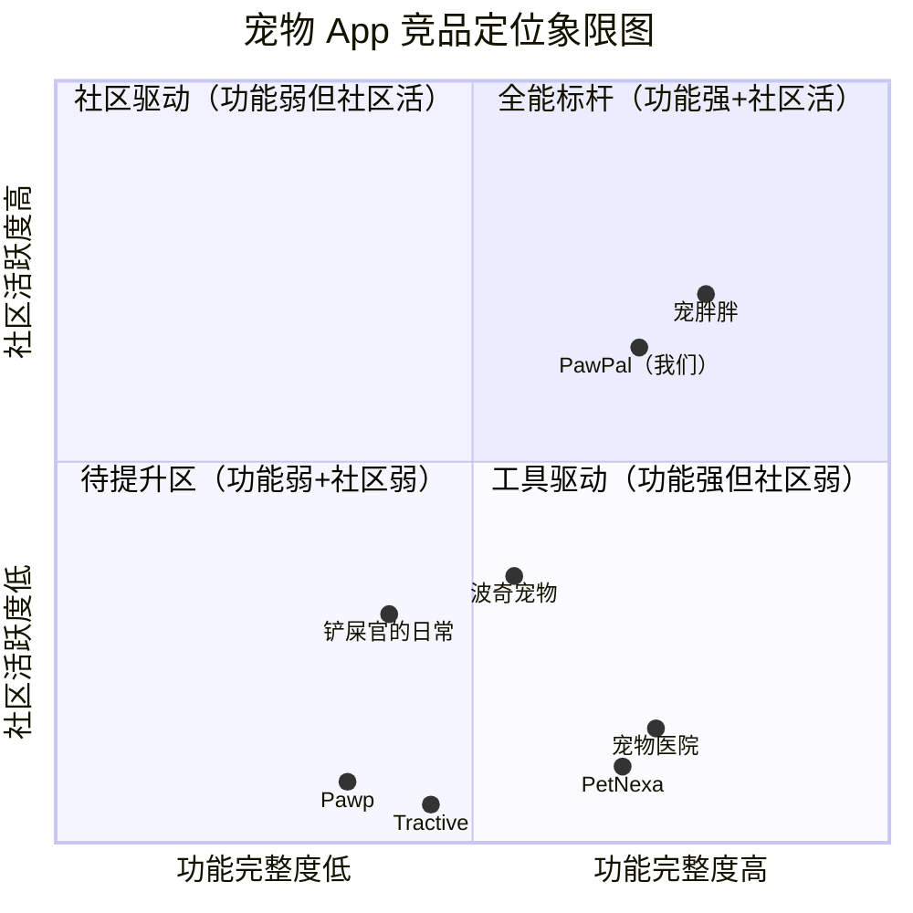

# 宠物健康管理 + 社区 Web App — 完整 PRD

> **版本**：v1.1（根据用户决策更新）
> **作者**：许清楚（产品经理）
> **日期**：2026-06-24
> **状态**：待评审（已确认 7 项关键决策，待架构师系统设计）

---

## 一、产品概述

### 1.1 产品名称建议

**PawPal（爪友）** — 取 Paw（爪子）+ Pal（伙伴）之意，中文暂定"爪友"。

备选名称：宠记 PetMate / 毛球圈 FurBall。

### 1.2 产品定位

一款**以宠物健康管理为核心、以兴趣社区为增长引擎**的 Web 应用。帮助养宠（犬/猫）用户系统化管理宠物健康档案、通过 AI 助手快速获取社区经验参考，同时在同好社区中分享日常、交流经验、建立信任关系。

**一句话定位**：养宠人的健康管家 + 同好社区。

### 1.3 目标用户画像

| 维度 | 描述 |
|------|------|
| **核心人群** | 22-35 岁城市养宠青年（95后/90后为主），养犬或养猫 1 年以上 |
| **次核心人群** | 35-50 岁中年养宠家庭、独居青年、空巢老人 |
| **养宠经验** | 以"1-3 年新手进阶"为主，有科学喂养意识但缺乏系统化工具 |
| **消费特征** | 年均宠物消费 2000-5000 元，愿意为宠物健康和品质生活付费 |
| **核心痛点** | ① 健康记录分散在纸质/备忘录，疫苗驱虫经常忘记；② 生病时不知是否紧急，信息搜索真假难辨；③ 养宠孤独，想找到同好交流但缺乏垂直社区；④ 网上养宠知识碎片化、难辨真伪 |
| **设备习惯** | 移动端为主，但 Web 端在"深度记录、长文分享、桌面浏览"场景有刚需 |

> **数据支撑**：2025 年中国城镇宠物猫狗数量达 **1.2988 亿只**，宠物市场规模突破 **3453 亿元**（艾瑞咨询）。95 后宠主占比 36.8%，已成主导群体。中国宠物渗透率约 22%，远低于美国 70%，发展空间巨大。

### 1.4 核心价值主张

1. **健康不遗漏** — 一站式电子健康档案 + 智能提醒，疫苗、驱虫、体检、就诊记录永久留存，告别纸质混乱。
2. **问题有人答** — AI 助手识别问题类型 → 搜索社区历史帖和外部社媒相似问题 → 总结归纳多方经验给出参考建议，附免责提示，帮助用户快速获得参考方向，减少不必要的焦虑和急诊奔波。
3. **同好不孤单** — 以犬/猫品种、城市为圈层的垂直社区，找到懂你的人，告别养宠孤独感。

---

## 二、竞品分析

### 2.1 竞品概览表

基于对国内外 7 款代表性宠物 App 的调研，从产品定位、核心功能、亮点、不足及用户评价五个维度分析如下：

| # | 产品名称 | 类型 | 核心功能 | 特点/亮点 | 不足之处 | 用户评价概况 |
|---|---------|------|---------|----------|---------|------------|
| 1 | **波奇宠物**（国内） | 电商+社区 | 宠物用品商城、社区动态、测评广场、达人推荐 | B2C+B2B2C 自营+商家入驻模式；社区测评与电商深度联动，种草转化率高；自营商品质量有保障 | 社区为电商辅助，社交氛围弱；社区内容每页展示信息少；动态入口层级深，操作不便 | App Store 评分一般；用户认可商品丰富度，但社区体验口碑下滑，活跃度不及早期 |
| 2 | **宠胖胖**（国内） | 综合服务+社区+O2O | 宠托师上门喂养、附近宠友 LBS、宠友圈社区、健康记录提醒、同城商家 | 宠托师认证严格（实名+技能+健康证明），全程视频反馈透明；LBS 同城社交精准匹配；全场景覆盖（社交+照料+购物+健康） | 三四线城市服务覆盖不足；宠友圈广告较多影响体验；电商以跳转第三方为主，闭环不完整 | 实用度 8.5/10；寄养刚需用户好评高，社交功能受欢迎；低线城市用户反馈资源少 |
| 3 | **铲屎官的日常**（国内） | 工具+社区 | 养宠日常记录、社区分享、宠物电商、科普文章 | 工具属性强，日常记录流程简洁；社区可设隐私公开选项；首页聚焦工具+科普，定位清晰 | 社区活跃度较弱；无草稿保存功能，退出即丢失编辑内容；视频发布限制多；无小宠异宠商品分类 | App Store 社区类排名靠前；用户认可记录工具的实用性，但社区互动不足 |
| 4 | **宠物医院**（国内） | 医疗问诊 | 24h 在线问诊、LBS 医院筛选预约、电子健康档案、AI 辅助诊断 | 应急问诊响应快（10 分钟内匹配兽医）；线上问诊比线下便宜 50%；电子档案自动更新，永久保存；AI 辅助分诊 | 专科医生回复慢；线上问诊无法做实验室检查，复杂病症仍需线下；社区功能缺失，纯工具属性 | 实用度 9.0/10（三款最高）；刚需性极强，用户满意度高；夜间急诊用户好评突出 |
| 5 | **PetNexa**（海外） | AI健康管理 | AI Vet 智能问诊、疫苗追踪智能提醒、健康评分、家庭共享（最多5人）、多语言（10种） | AI 分诊基于品种/年龄/病史个性化分析；健康评分主动预警趋势；家庭计划角色权限管理；多语言覆盖广 | 纯健康工具，无社区生态；无电商/服务闭环；依赖用户手动录入数据，冷启动门槛高 | 评分 4.7+；多宠物家庭、国际用户好评；AI 功能被认为是 2026 年最大差异化 |
| 6 | **Pawp**（海外） | 远程医疗 | 24/7 执业兽医视频问诊、健康基础记录 | 随时可视频连线真实兽医（非 AI）；问答质量高，用户信任度强 | 价格昂贵（$19/月，列表最贵）；无疫苗管理、无社区、无多语言；功能单一 | 评分 4.8/5（10000+ 评论）；兽医质量获好评，但性价比争议大 |
| 7 | **Tractive**（海外） | GPS+活动监测 | 无限距 GPS 定位、虚拟围栏、活动量记录、健康日志 | GPS 追踪无距离限制，精准度高；虚拟围栏防走失；健康日志可记录症状/用药/就诊 | 需购买硬件设备（项圈），门槛高；健康监测较基础；偏向犬类，猫支持弱；无社区 | GPS 用户满意度高；但被评价为"定位偏 GPS，非专业健康追踪" |

### 2.2 竞品象限图

以**功能完整度**（健康管理深度 + 功能覆盖广度）为横轴，**社区活跃度**（社交互动氛围 + 用户留存粘性）为纵轴：



### 2.3 市场定位分析与差异化机会

**市场缺口识别**：

| 象限 | 现状 | 机会 |
|------|------|------|
| 全能标杆（Q1） | 仅宠胖胖接近，但其健康深度不足、电商依赖跳转 | **核心机会区**：健康深度 + 社区活跃同时做强的产品几乎空白 |
| 社区驱动（Q2） | 波奇宠物社区为电商附属，铲屎官的日常社区弱 | 垂直社区有需求但现有产品未做好"健康话题驱动社交" |
| 工具驱动（Q4） | 宠物医院、PetNexa 功能强但零社区，用户用完即走 | 健康工具用户有社交需求未被满足 |

**我们的差异化策略**：

1. **健康 × 社区双引擎**：不做纯工具（宠物医院/PetNexa 的盲区），也不做纯社区（波奇/铲屎官的日常的浅层）。以健康档案为入口沉淀用户，以社区话题为留存引擎，两者互哺——健康记录可一键生成"成长日记"分享到社区，社区热门健康问题反哺知识库。

2. **AI 助手 + 社区互助互补**：PetNexa 的 AI 强但无社区，Pawp 的真人兽医贵且无社区。我们用 AI 助手做问题识别+社区/社媒内容搜索+总结归纳（不做医疗诊断，规避合规风险），复杂问题引导至社区求助有经验的资深宠主，形成"AI 归纳参考 + 同好互助"的轻问询闭环，避开昂贵的真人兽医成本和医疗合规风险。

3. **Web 优先的差异化场景**：现有竞品几乎全是移动端 App。Web 端在"深度健康记录录入、长文养宠经验分享、桌面场景浏览社区"有不可替代优势，且开发成本低于原生 App，适合概念验证阶段快速迭代。

4. **品种 + 城市双维度圈层**：现有社区多为泛宠物 feed 流（波奇/宠胖胖）。我们按犬/猫品种细分圈子（如"柯基圈""布偶圈"）+ 城市同城圈，内容精准度和社交匹配度更高。

---

## 三、用户故事

### 3.1 养狗用户故事

**US-D1（健康管理）**：作为一名养柯基 2 年的上班族，我希望能在 Web 端录入和查看煤球的疫苗、驱虫、体检记录，并在到期前收到提醒，这样我就不会因为工作忙而忘记给它做防护，也不用翻箱倒柜找纸质疫苗本。

**US-D2（问题参考）**：作为一名新手狗主，我希望在煤球半夜呕吐时能用 AI 助手快速搜索到社区里类似情况的经验帖和外部养宠文章，获得总结归纳后的参考建议（附免责提示），这样我就不用在各种碎片化信息里筛选，能初步判断是否需要紧急就医。

**US-D3（社区社交）**：作为一名住在杭州西湖区的柯基主人，我希望能在社区找到同城的柯基宠友约着周末遛狗，这样煤球有玩伴，我也能交流养狗经验、互换闲置用品，不再觉得遛狗是个人的事。

**US-D4（经验分享）**：作为一名成功帮狗狗减肥 3 公斤的资深宠主，我希望能在社区发布一篇详细的经验贴（附前后对比照和饮食方案），这样能帮助同样困扰的新手，也能获得社区认可。

### 3.2 养猫用户故事

**US-C1（健康管理）**：作为一名养布偶猫的独居青年，我希望系统自动管理年糕的疫苗和驱虫日程，并根据品种特性提醒我关注常见遗传病筛查（如布偶的 HCM 心肌病），这样即使我养猫经验不足，也能科学预防。

**US-C2（知识获取）**：作为一名刚养猫 3 个月的新手，我希望遇到"掉毛严重怎么办""换粮怎么过渡"等问题时，能用 AI 助手搜索社区历史帖和外部养宠文章，获得总结归纳后的参考建议，也能在社区直接浏览品种猫的饲养攻略和真实用户问答，这样能快速找到可信答案，而不是在各种碎片化帖子里筛选。

**US-C3（社区记录）**：作为一名猫奴，我希望把年糕的体重曲线、成长照片整理成"成长日记"一键分享到社区，这样既能记录它的成长历程，又能和同好交流互动，满足分享欲。

**US-C4（多宠管理）**：作为一名同时养猫和狗的双宠家庭用户，我希望能在同一账号下分别管理两只宠物的健康档案，互不混淆，这样全家人的养护责任分工更清晰。

---

## 四、需求池（按优先级分级）

> **P0 = MVP 必须有** | **P1 = 重要，可后续迭代** | **P2 = 锦上添花**

| 优先级 | 模块 | 需求描述 | 验收标准 |
|--------|------|---------|---------|
| **P0** | 健康档案 | 用户可创建宠物档案（名称、品种、性别、生日、体重、照片、绝育状态），支持多宠 | 每个账号可创建≥1 只宠物，档案字段完整可编辑，支持删除 |
| **P0** | 健康档案 | 健康记录管理：疫苗记录、驱虫记录、体检记录、就诊记录，每条含日期、项目、备注、图片 | 4 类记录均可增删改查，支持上传图片凭证，按时间倒序展示 |
| **P0** | 智能提醒 | 疫苗/驱虫到期提醒：根据上次记录日期 + 标准周期，自动计算下次时间并提醒 | 提前 7 天和 3 天各推送一次站内提醒，支持自定义周期 |
| **P0** | AI 助手 | AI 问题参考助手：用户输入宠物问题描述（文字+图片），AI 识别问题类型 → 搜索社区历史帖和外部社媒相似内容 → 总结归纳多方经验给出参考建议 + 免责声明（"仅供参考，不构成医疗诊断，复杂情况请就医"） | 响应时间 ≤ 15 秒；返回内容含问题类型标签 + 来源引用 + 参考建议 + 免责声明；不做医疗诊断，不给出用药剂量等具体医疗指令 |
| **P0** | 社区 | 社区动态发布：支持图文动态（标题+正文+图片），可关联宠物档案和话题标签 | 可发布图文，支持≥1 张图片，关联宠物和话题，动态展示在社区 feed |
| **P0** | 社区 | 社区 feed 流：按"推荐/最新"双 Tab 展示动态，支持点赞、评论 | 双 Tab 切换正常，互动实时更新，无限滚动加载 |
| **P0** | 社区 | 品种圈子：按犬/猫品种创建圈子，用户可加入圈子查看圈内动态 | 至少预设 20 个热门品种圈，用户可搜索/加入/退出圈子 |
| **P0** | 用户系统 | 注册/登录（邮箱+密码）、个人主页（头像、昵称、宠物列表、动态列表） | 注册登录可用，个人主页展示用户信息和内容 |
| **P1** | 社区 | 同城圈子：按城市创建同城圈，支持 LBS 定位匹配附近宠友 | 用户设置城市后自动推荐同城圈，圈内可发起线下活动 |
| **P1** | 社区 | 评论回复与消息通知：动态可多级评论，收到互动时站内通知 | 支持二级评论，通知中心展示点赞/评论/关注消息 |
| **P1** | 社区 | 用户关注系统：可关注其他用户，"关注" Tab 查看关注人动态 | 关注/取关正常，关注 feed 实时同步 |
| **P1** | 健康档案 | 体重曲线：记录体重变化，自动生成折线趋势图，标注健康范围 | 输入体重后自动更新图表，支持按月/季/年查看 |
| **P1** | 健康档案 | 成长日记：将健康记录+照片自动汇总为时间轴"成长日记"，可一键分享到社区 | 一键生成，自动按时间排序，分享到社区后可被他人查看 |
| **P1** | AI 助手 | AI 助手历史：保存历次咨询记录，可回看和追踪后续情况 | 咨询记录列表可查看，支持标记"已就医/已恢复/观察中" |
| **P1** | 知识库 | 养宠知识库：按品种分类的饲养指南文章（饮食、行为、常见病），支持社区搜索 | 至少 50 篇基础文章，按品种/主题分类，支持关键词搜索 |
| **P2** | 社区 | 话题广场与热门话题运营：创建 #今日萌宠# #养猫新手求助# 等运营话题 | 后台可创建/推荐话题，话题页展示相关动态 |
| **P2** | 健康档案 | 体检报告 OCR 识别：上传体检报告图片，自动提取关键指标录入档案 | 识别准确率 ≥ 80%，支持手动校正 |
| **P2** | AI 助手 | 品种特异性参考建议：基于品种+年龄，在 AI 助手返回结果中附加该品种常见问题参考和护理提示 | 至少覆盖 20 个热门品种的参考知识 |
| **P2** | 社区 | 内容举报与管理：用户可举报违规内容，后台审核处理 | 举报入口可用，后台可查看/处理举报 |
| **P2** | 用户系统 | 家庭共享：邀请家庭成员共同管理宠物档案，设置权限角色 | 最多邀请 5 人，支持管理员/查看者角色 |

---

## 五、UI 设计稿描述

### 5.1 整体设计原则

- **设计风格**：清新温暖，主色采用宠物友好的暖橙色（#FF8C42）+ 辅助薄荷绿（#4ECDC4），圆角卡片式布局，突出毛茸茸的亲和感
- **布局**：Web 端采用**左侧导航栏 + 中间内容区 + 右侧侧边栏**的三栏式布局（桌面端），响应式适配移动端
- **字体**：中文用系统默认无衬线字体，英文用 Inter
- **图标**：使用 Material Icons / Lucide 图标库，犬/猫相关用自定义插画

### 5.2 核心页面布局

#### 页面 1：首页（社区 Feed）
- **左侧导航栏**：Logo、首页、我的宠物、社区圈子、AI 助手、知识库、消息通知、个人主页
- **中间内容区**：
  - 顶部：Tab 切换「推荐 | 最新 | 关注」
  - 发布入口卡片：头像 + "分享你和毛孩子的故事..." 输入框 + 图片/视频图标
  - 动态卡片流：用户头像昵称 + 关联宠物标签 + 标题 + 正文摘要 + 图片九宫格 + 互动栏（点赞/评论/收藏）
  - 无限滚动加载
- **右侧侧边栏**：热门话题推荐、你可能感兴趣的圈子、同城宠友推荐

#### 页面 2：我的宠物（健康档案中心）
- **顶部**：宠物切换器（多宠头像横滑选择）+ 当前宠物大卡片（头像、名字、品种、年龄、体重）
- **Tab 切换**：「健康记录 | 成长日记 | 提醒日程」
- **健康记录 Tab**：
  - 快捷入口：+ 记录疫苗 / + 记录驱虫 / + 记录体检 / + 记录就诊（4 个彩色按钮）
  - 时间轴展示：按时间倒序展示所有记录，每条含类型图标、日期、项目名、备注、凭证图片
- **成长日记 Tab**：
  - 照片墙 + 时间轴，自动汇总健康里程碑（如"第一次疫苗""体重达到 5kg"）
  - "分享到社区"按钮
- **提醒日程 Tab**：
  - 日历视图 + 列表视图切换
  - 待办提醒卡片（红色=已过期，橙色=7天内，绿色=未来）

#### 页面 3：AI 助手（问题参考）
- **主界面**：搜索+总结式交互界面
  - 顶部提示："AI 助手 · 识别问题、搜索经验、总结参考 · 仅供参考，不构成医疗诊断，复杂情况请就医"
  - 输入区域：文字输入框（描述宠物问题）+ 图片上传（可选，如症状照片）+ "搜索参考"按钮
  - 结果展示区（卡片式）：
    - **问题类型标签**：AI 识别的问题分类（如"消化问题""皮肤问题""行为异常"）
    - **参考建议卡片**：AI 总结归纳的多方经验要点，分条列出
    - **来源引用列表**：引用的社区帖子标题+链接、外部文章标题+链接，用户可点击查看原文
    - **免责声明**：每条结果底部固定显示"以上内容来自社区和公开信息总结，仅供参考，不构成医疗诊断，复杂情况请及时就医"
  - 底部操作栏："去社区提问"按钮（引导用户到社区发起求助帖）+ "保存到咨询记录"按钮
- **侧边**：咨询历史列表（可回看历史咨询记录，支持标记状态）

#### 页面 4：圈子广场
- **顶部**：搜索栏 + 「热门圈子 | 我的圈子 | 同城圈子」Tab
- **圈子卡片网格**：每个圈子展示封面图、名称、成员数、最新动态数
- 点击进入圈子详情：圈子介绍 + 圈内动态 feed + 加入/退出按钮

#### 页面 5：个人主页
- **顶部横幅**：头像 + 昵称 + 简介 + 关注/粉丝数 + "编辑资料"按钮
- **Tab**：「动态 | 宠物 | 收藏」
- 动态 Tab：用户发布的所有动态列表
- 宠物 Tab：用户的宠物档案卡片列表（可点击进入健康档案）

### 5.3 核心页面流转

```
登录/注册 ──→ 首页（社区 Feed）
                  │
        ┌─────────┼──────────┬──────────────┐
        ▼         ▼          ▼              ▼
    我的宠物    AI 助手    圈子广场       个人主页
    (健康档案)  (问题参考)    │              │
        │                   ▼              │
        ├─→ 健康记录      圈子详情         │
        ├─→ 成长日记 ──→ 分享到社区 Feed   │
        ├─→ 提醒日程          │            │
        │                  圈内动态         │
        └─→ 体重曲线         │            │
                          发布动态          │
                            │              │
                            └──→ 动态详情 ──┘
                                  │
                              评论/点赞
```

**关键流转说明**：
1. **新用户冷启动**：注册后引导创建第一只宠物档案 → 引导加入品种圈子 → 进入首页 Feed
2. **健康 → 社区转化**：成长日记一键分享到社区，是健康用户转化为社区内容生产者的核心路径
3. **AI 助手 → 社区转化**：AI 助手结果页底部"去社区提问"按钮，引导用户进入社区发起求助帖深度交流
4. **社区 → 健康转化**：社区热门健康话题引导用户完善自己的健康档案

---

## 六、已确认决策（原待确认问题，用户已逐项确认）

| # | 问题 | 用户决策 | 备注 |
|---|------|---------|------|
| 1 | **AI 模块方案** | ✅ 已确认：**不做 AI 诊断/分诊**。改为 AI 助手模式——识别问题类型 → 搜索社区历史帖和外部社媒相似内容 → 总结归纳给参考建议 + 免责声明。不给出医疗判断，规避合规风险 | 已更新至需求池 P0、UI 设计稿、用户故事 |
| 2 | **AI 合规与免责** | ✅ 已确认：随问题 1 一并解决。AI 助手不涉及医疗诊断，仅做信息检索和总结，附免责声明（"仅供参考，不构成医疗诊断，复杂情况请就医"），无需医疗资质合作 | 免责声明措辞已纳入 UI 设计稿 |
| 3 | **社区冷启动** | ✅ 已确认：预填充 50+ 篇品种饲养知识 + 邀请 20-30 位种子用户（KOC）提前产出内容 | 运营需在上线前完成内容准备 |
| 4 | **Web → App 路线** | ✅ 已确认：Web MVP 验证 3 个月后，基于数据决定是否启动移动端；技术架构需预留 API 复用能力 | 需传达给架构师：API 设计需前后端分离，预留移动端复用 |
| 5 | **商业模式** | ✅ 已确认（详见下方第七章） | — |
| 6 | **数据隐私与安全** | ✅ 已确认：按合规方案执行——明确数据加密方案、用户数据导出/删除权利（GDPR/个人信息保护法） | 需传达给架构师：数据加密、用户数据导出/删除功能 |
| 7 | **品种数据库** | ✅ 已确认：参考 WSAVA 疫苗指南 + 中国小动物保护协会数据，P2 阶段寻求兽医顾问合作 | — |

---

## 七、商业模式（用户已确认）

### 7.1 盈利方向

用户已明确以下三个盈利方向，MVP 阶段暂不实现，但产品架构需预留扩展能力：

| 方向 | 模式 | 说明 |
|------|------|------|
| **会员订阅** | 基础版免费 + 高级功能订阅制 | **基础版完全免费，不加入广告**。高级功能（如 AI 助手深度分析、品种专属健康预警、无限成长日记等）为付费订阅 |
| **电商板块** | 宠物用品商城 / 佣金分成 | 作为盈利模式之一，可后期接入 |
| **社区内容变现** | 品牌合作 / 付费内容 / 增值服务 | 可后期探索 |

### 7.2 MVP 阶段原则

- **基础版完全免费，无广告**：用户已明确要求，基础健康档案管理 + 社区核心功能全部免费
- **聚焦用户增长**：MVP 不考虑盈利，优先验证产品价值和用户留存
- **架构预留**：技术架构需为后续会员体系、电商接入预留扩展能力

---

## 附录：调研数据来源

- 艾瑞咨询《2025 年宠物科技用品发展研究白皮书》
- 中国宠物行业白皮书（2022-2025）
- 人人都是产品经理：波奇宠物/铲屎官的日常/宠胖胖竞品分析
- 网易/什么值得买：2025 宠物 APP 实测（宠胖胖/买只宠物/宠物医院）
- PetNexa / TechnoBark / Idea Usher：2026 海外宠物健康 App 评测
- GM Insights：2025 宠物科技市场报告（156 亿美元，预计 2033 年宠物护理 App 市场 38 亿美元）
